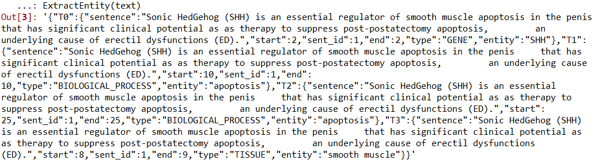
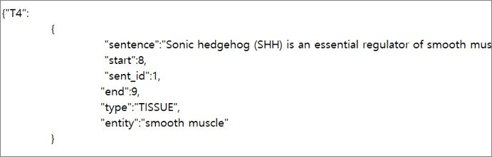

# MELKE
python package that extracts entities and relations from bio-text
     
## about MELKE
### 1. Installation
You can install MELKE package with PIP INSTALL 
 https://pypi.org/project/MELKE/1/
> pip install MELKE

   

### 2. Functions
There is a module contains 2 functions.  
- Module: EntityRelation
- Functions: ExtractEntity, EntityRelation
##### 1. ExtractEntity
- Extract all of entities from input which is BIO-text.  
- It will return the result with python dictionary object.  
- Key is entity_id and value is dictionary of information about entity.  
##### 2. EntityRelation
- Extract all of entities and relations from input which is BIO-text.  
- It will return the result with python dictionary object.  
- Key is entity_1_entity_2 (connect first entity and second entity with under bar) and value is dictionary of information about relation.      

### 3. Examples
#### 0. First import
> 

If you import module very first time, Resources will be downloaded by init file.
And you will see this message from your console.

#### 1. How to use

   
#### 2. Returned object of ExtractEntity

   
#### 3. Returned object of EntityRelation

   
#### 4. Structure of dictionary (ExtractEntity)

   
#### 5. Structure of dictionary (EntityRelation)

   
